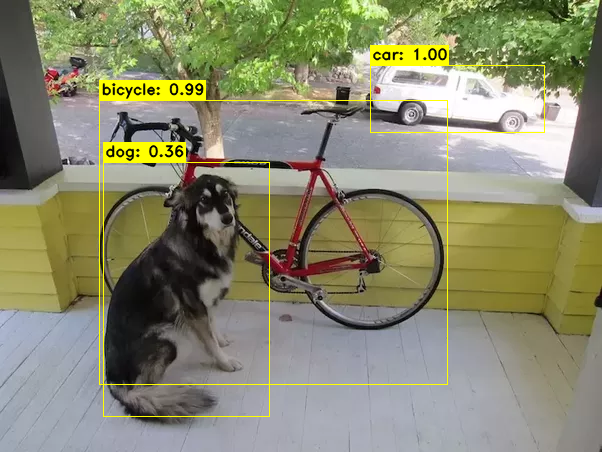

# README

This project detects objects inside images and videos through an an VGG16 SDD Neural Network. It is derived from Max deGroot project (https://github.com/amdegroot/ssd.pytorch).

The original project was developed for PyTorch 0.3. This project updates the original project to run with PyTorch 1.5.


## Quick Startup

### Download SDD weights

Download the SSD weights from [here](https://drive.google.com/file/d/1gwSRh2NZvfJ4mWiBPqV1aya68S_-PRWA/view?usp=sharing) and copy them in the `weights` folder.


### Create a Virtual Environment

If you are on MacOS or Linux, type the following command to create a python virtual environment and install the required packages:

```bash
./configure.sh
```

Then, activate the virtual environment:

```bash
source .venv/bin/activate
```

***Nota***:
<br>This project requires `python 3`. You must install it first.


### Run

Under the virtual environment, execute the command:

```bash
python src/main.py -f './img/dog-bicycle.png' -t 'image' -o './img/dog-bicycle-out.png'
```

You should get this image:




## License

MIT.
